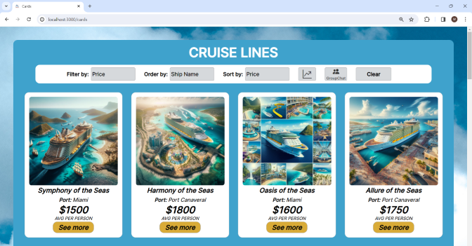
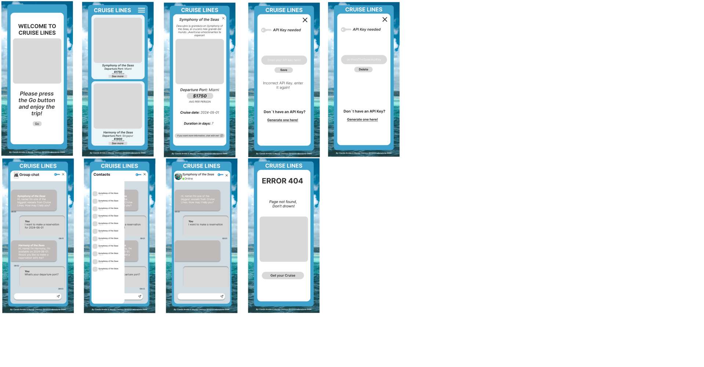
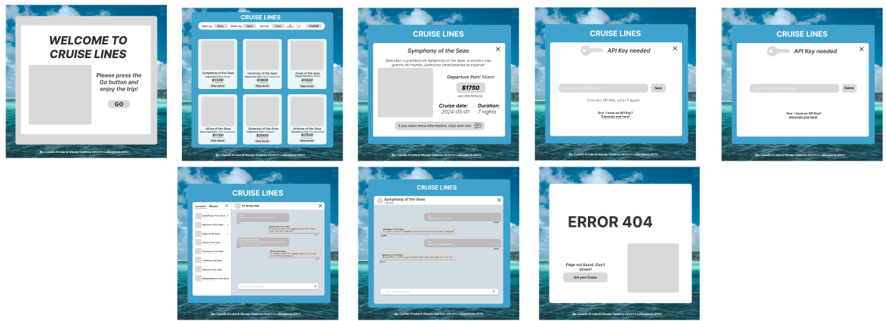
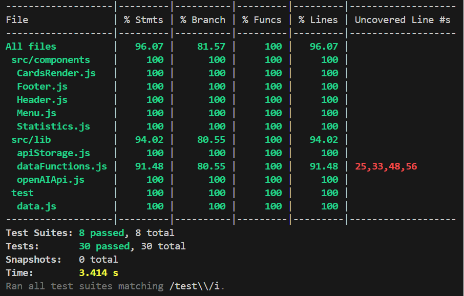

# Cruise Lines Dataverse Chat

## Índice

* [1. Resumen del proyecto](#1-resumen-del-proyecto)
* [2. Funcionalidades](#2-funcionalidades)
* [3. Estructura](#3-estructura)
* [4. Tecnologías y Herramientas](#4-tecnologías-y-herramientas)
* [5. Definición del Producto](#5-definición-del-producto)


***

## 1. Resumen del proyecto
El presente proyecto es una SPA (Single Page Application) donde mantuvimos las funcionalidades del proyecto [detaverse](https://wendy-alejandra.github.io/DEV013-dataverse/) para visualizar un conjunto o set de datos de cruceros que se puede filtrar, ordenar y calcular una estadística (promedio de precios de los cruceros), adicionando nuevas vistas para consultar información detallada de cada crucero, implementado mediante la creación de un router para la navegación entre las diferentes vistas de la aplicación, y agregando la posibilidad de interactuar individualmente o de forma grupal con los cruceros a través de un sistema de chat impulsado por la API de OpenAI, usando la asincronía en JavaScript y creando una suite de pruebas unitarias para probar el código asíncrono.

<p align="center">

</p>

## 2. Funcionalidades
En este proyecto se **construyó una SPA (Single Page Application) en donde se visualiza un  _conjunto (set) de datos_ de cruceros** generados con la herramienta de Inteligencia Articial [ChatGPT](https://openai.com/chatgpt) y tiene las siguientes funcionalidades:

* Todos los nombres de los cruceros se ordenan de la (A-Z) y de la (Z-A).
* Todos los cruceros se pueden ordenar igualmente por precios desde el precio más bajo al más alto y desde el más alto al más bajo.
* Los cruceros se pueden filtrar y a su vez ordenar por nombres de la (A-Z) O de la (Z-A) y/o desde el precio más bajo al más alto y desde el más alto al más bajo.
* Se calcula la estadística de todos los cruceros, así como la estadística de los cruceros ya filtrados.
* Se puede acceder a una vista detallada de cada crucero.
* Se puede acceder a un chat grupal mediante un botón ubicado en el menú superior de la vista cards, donde se puede interactuar con los los cruceros.
* Se accede a un chat individual para cada crucero haciendo click en un botón "See more".
* Para chatear con el crucero o los cruceros, si no hay una API key guardada se accede a una vista donde se debe introducir una API key. Al guardarse presionando el botón "Save", éste te redirecciona automáticamente a la vista del chat individual y/o grupal, dependiendo de cuál se haya seleccionado.


## 3. Estructura del proyecto

La lógica del proyecto debe se implementó completamente en JavaScript
(ES6), HTML y CSS. 
El _boilerplate_ que del proyecto es el siguiente:

```text
.
├── src
|  ├── components
|  |  └── CardsRender.js
|  |  └── Footer.js
|  |  └── Header.js
|  |  └── Menu.js
|  |  └── Statistics.js
|  ├── data
|  |  └── dataset.js
|  ├── lib
|  |  └── apiStorage.js
|  |  └── dataFunctions.js
|  |  └── openAIApi.js
|  ├── views
|  |  └── adventurOfTheSeasAruba.jpeg
|  |  └── ApiKey.js
|  |  └── Cards.js
|  |  └── Error.js
|  |  └── GroupChat.js
|  |  └── Home.js
|  |  └── IndividualChat.js
|  |  └── MoreInfoCards.js
|  ├── error.png
|  ├── favicon.png
|  ├── fondo_cruceros.jpg
|  ├── index.html
|  ├── index.js
|  ├── router.js
|  └── style.css
├── test
|  └── apiKey.spec.js
|  └── cardsRender.spec.js
|  └── data.js
|  └── dataFunctions.spec.js
|  └── footer.spec.js
|  └── header.spec.js
|  └── menu.spec.js
|  └── openAIApi.spec.js
|  └── statistics.spec.js
├── README.md
└── package.json

```
## 4. Tecnologías y herramientas
* Este proyecto se realizó en dupla.
* El proyecto se completó en 8 sprints.
* La lógica del proyecto se implementó completamente en JavaScript (ES6+), HTML y CSS.

<p align="center">
  
  
     
</p>

### JavaScript
#### 1. Arquitectura de SPA y Enrutamiento:

Cruise Lines es una Single Page Application (SPA) gracias a un router construido completamente en JavaScript vanilla. Este enrutador permite la transición fluida entre diferentes vistas, mejorando la navegación del usuario.

#### 2. Manipulación Dinámica del LocalStorage:

Utilizamos JavaScript para acceder y manipular de manera dinámica el LocalStorage del navegador. Esta capacidad permite un almacenamiento eficiente de datos locales, mejorando la interactividad y proporcionando una experiencia personalizada al usuario.

#### 3. Gestión de Pathname:

La habilidad de acceder al pathname de la página mediante JavaScript proporciona información en tiempo real sobre la ubicación del usuario en la aplicación. Esto contribuye a una navegación más informada y contextual.

#### 4. Consumo Eficiente de OpenAI API:

Para el consumo de la API de OpenAI para el manejo de promesas, se usó fetch en JavaScript. Esta integración permite acceder a la funcionalidad de OpenAI desde Cruise Lines.

#### 5. Componentes:

Implementamos una estructura basada en el uso de componentes. Esta metodología facilita el mantenimiento del código, mejora la modularidad y permite un desarrollo más escalable.

* Las herramientas usadas fueron:
<p align="center">
  
  
  
  
</p>


## ---MODIFICAR: AGREGAR EL LINK DEL PROYECTO YA DESPLEGADO---
* La interfaz del proyecto fue desplegada en GitHub pages y en 
  [Vercel](https://vercel.com/) o [Netlify](https://www.netlify.com/).

## 5. Definición del producto

Para realizar el presente proyecto, se definieron 3 historias de usuario, se diseñó la interfaz de usuaria mediante el uso de sketches o prototipos de baja fidelidad y prototipos de alta fidelidad en [Figma](https://www.figma.com/file/V5doEKg8V9PpNrpNUzrGH3/Prototipos-HU1?type=design&node-id=0-1&mode=design&t=oiz0EfUpai0hLcqp-0) para cada una de las vistas de nuestra SPA.

### Historias de usuaria
La herramienta usada para planificar y organizar las Historias de Usuarios fue [Trello](https://trello.com/b/6IbzkL5B/dev013-dataverse-chat)

HU1: Yo como usuario quiero un bosquejo interactivo en figma para ver cómo va a quedar mi sitio web y dar un feedback

HU2: Yo como usuario quiero que se estructure de forma adecuada una SPA y se muestre cada vista de mi sitio en el navegador para ver los cruceros disponibles para vacacionar y así poder navegar de forma más rápida mi sitio de cruceros

HU3: Yo como usuario quiero poder chatear de forma individual y/o grupal con un crucero(s) ingresando una API Key de Open AI


### Diseño de la Interfaz de Usuaria
El dieseño de nuestra SPA se realizó con la herramienta de diseño [Figma](https://www.figma.com/file/V5doEKg8V9PpNrpNUzrGH3/Prototipos-HU1?type=design&node-id=0-1&mode=design&t=RBWKfeMFY3DVlC7R-0). Ver a continuación, los prototipos de alta y baja fidelidad realizados:

#### Prototipo de baja fidelidad o Sketch
<p align="center">
  
  
</p>


#### Prototipo de alta fidelidad 
<p align="center">
  
  
</p>

### Testeos de usabilidad
Durante el proceso de testeo de usabilidad, se identificaron varias áreas de mejora en la interfaz de usuario, así como oportunidades para optimizar la experiencia del usuario. A continuación, se detallan las modificaciones realizadas en base a los hallazgos obtenidos:

1. **Agregación de Botones Explicativos:**
   - Se añadieron botones explicativos que redirigen a vistas específicas, con el objetivo de mejorar la navegación y proporcionar una guía clara sobre las funcionalidades disponibles.

2. **Reubicación del Botón de Chat Grupal:**
   - El botón de chat grupal fue reubicado hacia arriba, siguiendo los principios de visual design para garantizar diseños ergonómicos, especialmente para personas diestras, lo que facilita su accesibilidad y uso.

3. **Modificación en la Presentación del Precio de los Cruceros:**
   - Se eliminó el estilo de botón del precio de los cruceros en las tarjetas, ya que no representaba una acción interactiva. En su lugar, se integró este detalle al botón "Ver más" para acceder a información adicional de la tarjeta correspondiente.

4. **Reorganización de los Botones de Chat Individual:**
   - Los botones de chat individual, previamente ubicados en cada tarjeta en la vista de "Cards", fueron trasladados a la vista de "More Info Cards", simplificando así la interfaz y evitando redundancias.

5. **Optimización de la Vista de API Key:**
   - Se implementó una validación previa de la API introducida, con el propósito de mejorar la experiencia del usuario al garantizar la corrección de la API ingresada. Además, se ajustó el diseño para reflejar el estado de validación de la API y se añadió la capacidad de eliminar la API guardada.

6. **Inclusión de Botón de Regreso en Vistas de Chat:**
   - Se agregó un botón con forma de llave en las vistas de chat individual y grupal para permitir un retorno fácil y claro a la vista de la API Key, abordando así la carencia de una opción de regreso previa.

7. **Rediseño de la Vista de Error:**
   - Se realizaron modificaciones en el diseño de la vista de error para reducir la sobrecarga visual y mejorar la visibilidad del botón de acción. El botón fue agrandado para indicar claramente al usuario que puede continuar navegando libremente por el sitio tras presionarlo.

Estas modificaciones se llevaron a cabo con el objetivo de mejorar la usabilidad y la experiencia del usuario en la plataforma, optimizando la navegación, la accesibilidad y la comprensión de las funcionalidades disponibles.


### Pruebas unitarias
Las pruebas unitarias de nuestro proyecto se ejecutan con el comando `npm run test` y tienen una cobertura del 100% de statements (sentencias), functions (funciones), lines (líneas), y branches (ramas) para todos los componentes, api storage y funciones asícronas, y un 91.48% para el archivo dataFunctions.js donde están las funciones de filtrado y ordenamiento.

<p align="center">

</p>


